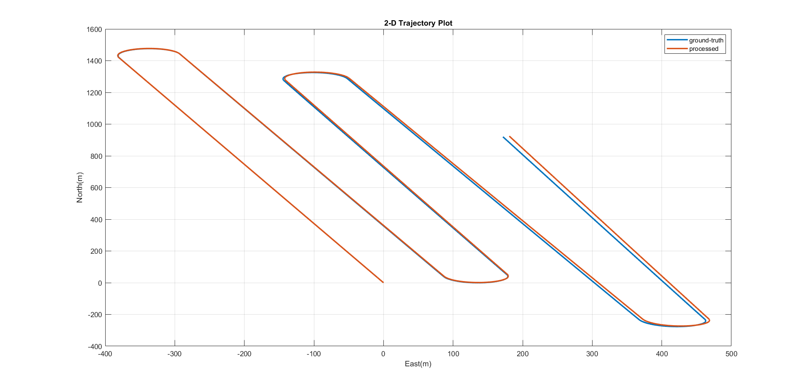

# Inertial-Navigation-System-INS-Forward-and-Inverse-Kinematics

This repository presents the implementation and analysis of forward and inverse kinematics
for an Inertial Navigation System (INS) using IMU data in MATLAB. Forward kinemat-
ics processes raw IMU measurements to estimate the 3D Position, Velocity, and Attitude
(PVA), while inverse kinematics generates simulated IMU data from a given PVA. Addi-
tional experiments examine the impact of IMU noise, Earth’s rotation, and the Coriolis
effect on PVA accuracy, each of which has a different level of influence on the results.

## Results

