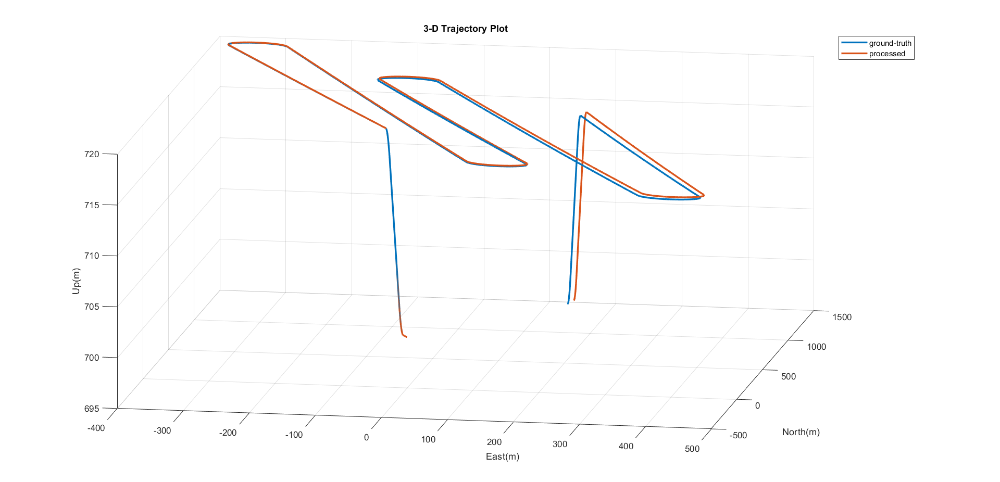
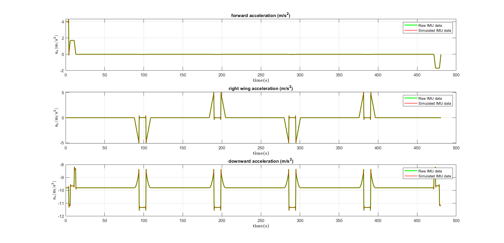
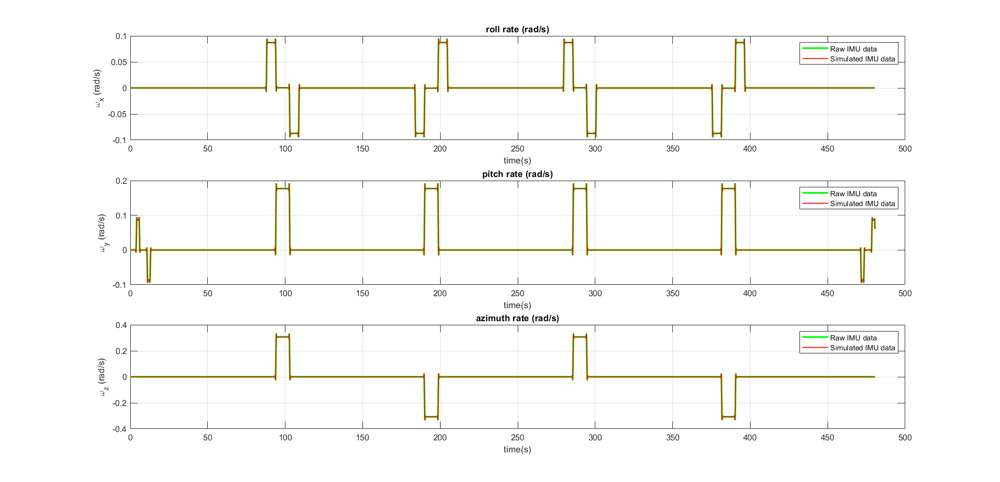

# IMU-Based Forward and Inverse Kinematics for Inertial Navigation System (INS)

## 🧭 Overview

This project implements **forward and inverse kinematics** for an **Inertial Navigation System (INS)** using IMU (Inertial Measurement Unit) data in **MATLAB**.  
Forward kinematics processes raw IMU measurements to estimate the **3D Position, Velocity, and Attitude (PVA)**, while inverse kinematics reconstructs simulated IMU data from given PVA trajectories.  

The experiments analyze the impact of:
- Gyroscope noise and bias,  
- Neglecting Earth’s rotation rate, and  
- Neglecting Coriolis effects  

on the resulting navigation accuracy.

---

## 📂 Dataset Description

| Variable | Description |
|-----------|--------------|
| `lat`, `lon`, `h` | Latitude (rad), Longitude (rad), and Altitude (m) |
| `vel_N`, `vel` | Velocity in ENU and NED frames |
| `roll`, `pitch`, `heading` | Orientation angles (rad) |
| `gyro_clean`, `accel_clean` | Clean IMU gyroscope (rad/s) and accelerometer (m/s²) data |
| `gyro_noisy`, `accel_noisy` | Noisy IMU data |
| `time` | Time vector (s) |

---

## ⚙️ Tasks

### 🧩 Task 1 – Forward Kinematics
Implement the INS mechanization equations:
1. **Attitude Update** – Quaternion kinematic equation  
2. **Velocity Update** – Compensate for gravity, Earth rate, and transport rate  
3. **Position Update** – Integrate local velocity to update position  

---

### 🔊 Task 2 – Effect of IMU Noise and Error Compensation
Study how sensor errors and modeling assumptions affect performance.

1. **Add Bias & Random Noise** to z-axis gyro  
   - Observe drift in heading and position over time  
   - Noise introduces short-term fluctuations; bias causes systematic drift  
2. **Ignore Earth Rotation** (`ω_IE = 0`)  
   - Minimal effect on orientation  
   - Causes drift in East velocity and position  
3. **Ignore Coriolis Effect**  
   - Negligible impact on attitude  
   - Introduces steady velocity bias and slight trajectory offset

---

### 🔁 Task 3 – Inverse Kinematics
Reconstruct simulated IMU measurements from known PVA.

**Steps:**
1. Compute body-frame accelerations from PVA.  
2. Add gravity and Coriolis compensations.  
3. Compute body-frame angular rates from DCM differentiation.  
4. Compare simulated accelerometer and gyroscope data with clean IMU measurements.

---

---

## 📈 Results

| **Metric** | **RMSE** | **Unit** |
|-------------|-----------|-----------|
| Velocity East Error | 0.028045 | m/s |
| Velocity North Error | 0.015046 | m/s |
| Velocity Up Error | 0.000819 | m/s |
| Position East Error | 3.75 | m |
| Position North Error | 2.45 | m |
| Altitude Error | 0.15 | m |
| Roll Error | 0.000038 | ° |
| Pitch Error | 0.000014 | ° |
| Heading Error | 0.000021 | ° |

**Summary:**
- Forward kinematics reproduced reference PVA almost exactly.  
- IMU noise introduced small drift; bias caused systematic errors.  
- Ignoring Earth rotation led to noticeable eastward drift.  
- Ignoring Coriolis effect added steady offsets but small overall error.  
- Inverse kinematics successfully reconstructed IMU signals.

---

## 📊 Visualization Examples

### Forward Kinematics Results

### Inverse Kinematics Results

